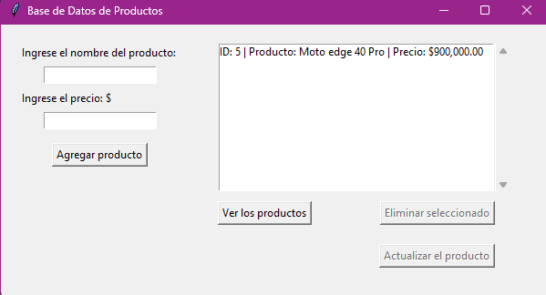

# BASE DE DATOS DE PRODUCTOS CON INTERFAZ GFRAFICA 

Aplicación de escritorio desarrollada en Python que permite gestionar productos mediante una interfaz gráfica.

Incluye funcionalidades de alta, visualización, actualización y eliminación de registros persistidos en una base de datos SQLite, con validaciones, manejo de errores y mejoras de experiencia de usuario.

## ⚙️ Funcionalidades

- Agregar productos con validaciones

- Visualizar productos en una lista

- Actualizar productos seleccionados

- Eliminar productos con confirmación

- Persistencia con SQLite

- Interfaz gráfica con Tkinter

- Scrollbar y manejo de selección

## 🛠️ Tecnologías

- Python

- Tkinter

- SQLite

## Cómo ejecutar 

1. Clonar el repositorio
2. Ejecutar el archivo principal:

python app.py  
o (en Windows):
py app.py

## Capturas 

